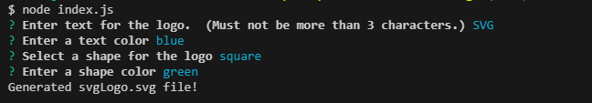

# Trevors-Basic-Logo-Maker  
Creates an SVG file to be used as a basic logo.  
  

## Description  
Allows the user to create a logo after giving information about the text, text color, shape, and shape color.  The logo will be saved as an SVG file.  
Walkthrough Video:  

Example of responses given:  
  

## Table of Contents  
* [Installation](#installation)  
* [Usage](#usage)  
* [License](#license)  
* [Contributing](#contributing)  
* [Tests](#tests)  
* [Questions](#questions)

## Installation  
To install necessary dependencies, run the following command:  

```  
npm install  
npm i inquirer@8.2.4  
```  

## Usage  
Nothing  

## License  
This project is licensed under the MIT license.  

## Contributing  
Modified by: Trevor Blanchard  
The link to the repo for this project is located at: https://github.com/blanchardt/Trevors-Basic-Logo-Maker  

### index.js  

line 25:  
went to https://stackoverflow.com/questions/16048148/regex-to-check-if-whitespace-present to figure out how to check for spaces
in regualr expressions.  
user1869870, jfriend00, kennebec, Andrew Clark, Kenneth, Dinoop Unnikrishnan, icanc, &amp; Iwo Kucharski. (2013, April   
&nbsp;&nbsp;&nbsp;&nbsp;&nbsp;16). Regex to check if whitespace present?. Stack Overflow. https://stackoverflow.com/questions/16048148/regex-to-check-if-whitespace-present   


## Tests  
To run tests, run the following command:  

```  
npm test  
```  

## Questions  
If you have any questions about the repo, open an issue or contact me directly at blanchardt@merrimack.edu.  You can find more of my work at [blanchardt](https://github.com/blanchardt/).  